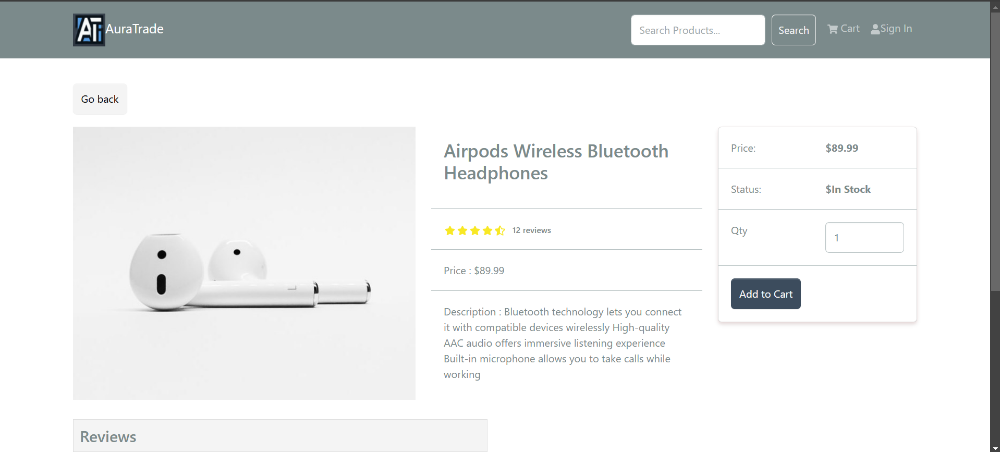
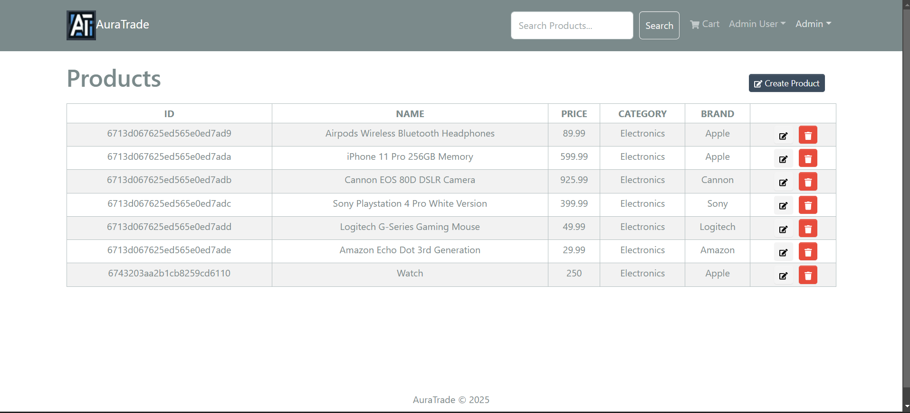

# Auratrade

Developed a full-stack e-commerce web application with React, Redux, Express, and MongoDB, featuring functionalities such as user authentication, product management, cart/checkout, and payment gateway integration (PayPal). Implemented RESTful APIs, CORS handling, and dynamic image uploads in production.

---

## Features

### Frontend
- Built with **React** and **Redux Toolkit**.
- Responsive UI designed using **React-Bootstrap**.
- Custom hooks
- Router-based navigation with nested routes using `Outlet` from `react-router-dom`.
- Reusable components like **Rating**.
- Efficient state management with **Redux Slices** (e.g., ProductSlice, CartSlice, AuthSlice).
- Authentication handled via JWT stored in HTTP-only cookies.
- PayPal integration using `@PayPal/react-paypal-js`.

### Backend
- Developed using **Express** and **MongoDB**.
- Middleware:
  - **asyncHandler** for error handling.
  - Custom authentication middleware.
- Data fetched via RESTful APIs using **Axios**.
- Organized structure with routes, controllers, and models
### Database
- Database connection using **Mongoose**.
- Models for Users, Products, and Orders.
- Seeder script for populating and destroying initial data.
- **MongoDB Atlas** as the database solution.

### Authentication
- JWT-based authentication.
- Tokens stored in secure, HTTP-only cookies.
- Middleware for protected routes.

### Payment
- Integrated PayPal as the payment gateway.
- Dynamically fetch PayPal client ID from the server.

### Image Upload
- Image upload functionality using `multer`.
- Static folder setup for storing and serving uploaded files.

---

.
### Prerequisites
- Node.js
- MongoDB

### Installation
1. Clone the repository:
   ```bash
   git clone https://github.com/Atharva-Nimbalkar/auratrade
   cd auratrade
   ```
2. Install  Dependencies:
   ```bash
   npm install
   cd frontend && npm install
   ```
3. Set up environment variables:
  Create a .env file in the root directory:
   ```bash
   NODE_ENV = development
   PORT=8000
   MONGO_URI=your-mongodb-uri
   JWT_SECRET=your-jwt-secret
   PAYPAL_CLIENT_ID=your-paypal-client-id
   PAGINATION_LIMIT=8
   ```
4. Populate the database:
  ```bash
   npm run data:import
   ```

### Run the Application

#### Run frontend (:3000) & backend (:5000)
   ```bash
   npm run dev
   ```

#### Run backend only
  ```bash
   npm run server
   ```

### Build and deploy

####  Create frontend prod build
  ```bash
  cd frontend
  npm run build
  ```
   
----

### Feel free to contribute to this project! Fork, star, and raise issues to enhance the functionality
## Screenshots


